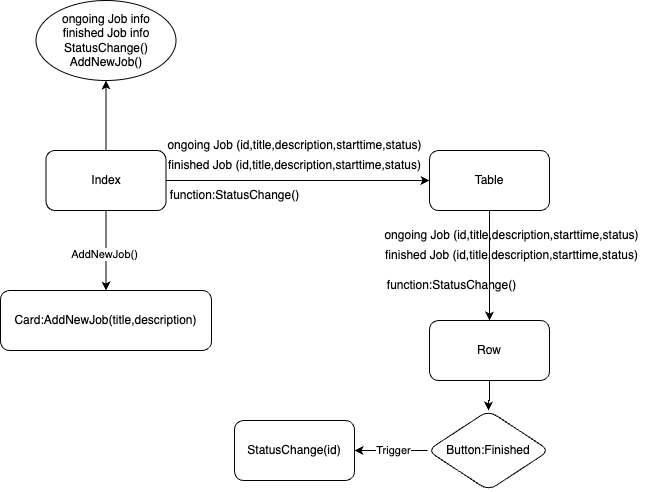

# Chapterone-Techtest
📱 Project Overview
This is a simple mobile task management app built with React Native and Expo. It enables users to efficiently track jobs from creation to completion. The interface is clean and responsive, with a popup card for task input and real-time updates as tasks move between states.
Core Features
## ✅ Core Features

| Feature               | Description                                                             |
|------------------------|-------------------------------------------------------------------------|
| 📝 Add New Task         | Create a new job task using a floating input card                       |
| 📋 View Ongoing Tasks  | Scroll through all tasks that are currently unfinished                  |
| ✔️ Mark as Finished     | Move a task from "ongoing" to "finished" with a single button click     |
| 📦 View Finished Tasks | Completed jobs are displayed in a separate, dedicated section           |
| 🎯 Real-time Updates   | Task state updates and list rendering happen immediately and smoothly   |
| 🧊 Popup Modal UI      | Card input appears in a floating overlay for better UX interaction      |

## App Structure

